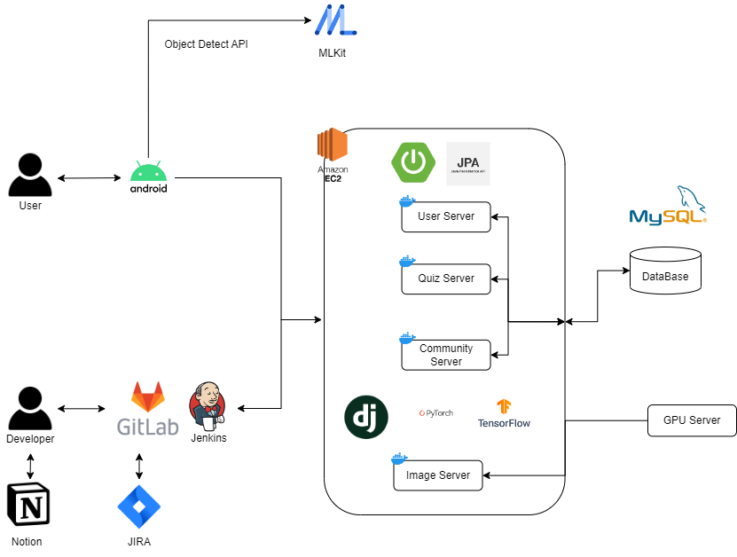
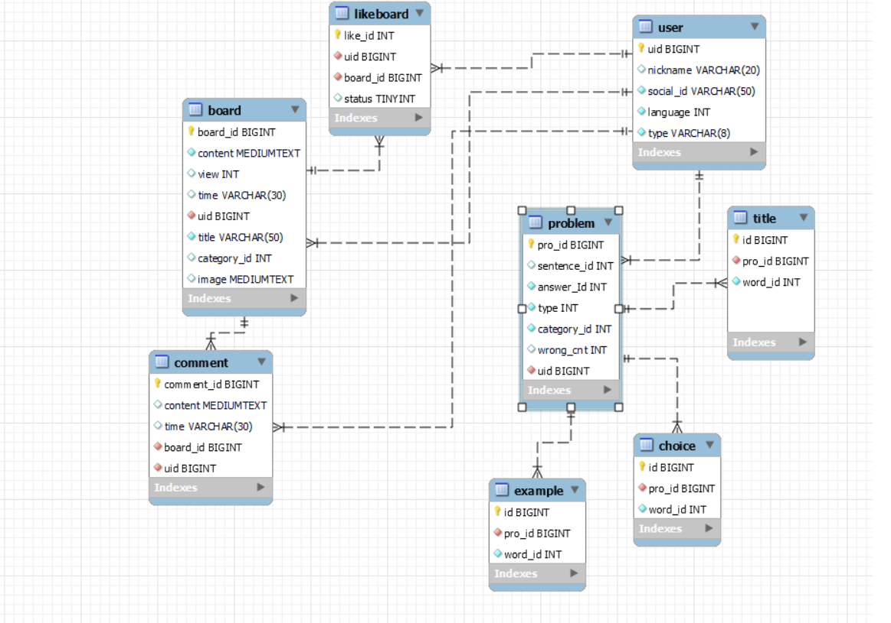

# 특화 프로젝트 D202

# :rocket: 프로젝트 소개
## :pencil2: 점점 증가하는 다문화 학생들을 위한 교육 앱 'URIDA' :pencil2:
- 한국어ㆍ베트남어ㆍ중국어ㆍ영어 4개 국어를 지원하여 **약 70%** 의 다문화 학생들이 사용할 수 있습니다.
- 지문 및 단어를 클릭하면 해당 단어를 **음성**으로 읽어줍니다.
- tts stt 설명,,,
- 무엇을 학습했고,,,

- - -
### :memo: '단어학습'을 통해 기초 단어를 익혀보아요!
- **단어익히기**: 유닛1~유닛6까지 원하는 유형의 단어를 학습할 수 있습니다.
- **퀴즈 풀기**: `단어익히기`를 통해 학습한 단어를 기반으로 네 가지 유형의 퀴즈들을 풀어볼 수 있습니다.
- **다시 풀어보기**: `퀴즈풀기`에서 틀린 문제를 확인할 수 있습니다. 정답 확인 버튼을 통해 답을 확인할 수 있습니다.

- - -
### :camera: '사진찍기' 기능을 사용하여 카메라에 감지된 물체들을 탐지해보아요!
- **실시간으로 확인하기**: 카메라를 사용하여 실시간으로 물체의 이름을 확인할 수 있습니다.
- **사진찍기**: 카메라로 사진을 촬영하여 해당 이미지에 나타난 사물 목록을 확인할 수 있습니다.
- **갤러리에서 불러오기**: 갤러리에서 불러온 이미지에 나타난 사물 목록을 확인할 수 있습니다.

- - -
### :mag: '찾아보기' 기능을 통해 그림과 음성을 활용하여 원하는 단어를 찾아보아요!
- **그림으로 찾기**: 그림을 그려 해당 그림이 어떤 단어인지 확인할 수 있습니다.
- **음성으로 찾기**: 녹음한 음성이 어떤 단어를 의미하는지 이미지와 함께 확인할 수 있습니다.

- - -
### :sparkles: '커뮤니티'를 통해 함께 이야기를 나누어보아요!
- **자유 게시판**: 게시글 작성을 하여 사람들과 소통할 수 있습니다.
- **그림 게시판**: `찾아보기 - 그림으로 찾기`에서 인식하지 못한 그림을 공유하여, 다른사람들과 함께 이야기 나눠볼 수 있습니다.

- - -
# 📚 기술스택

| 분야 | 사용기술 |
| --- | --- |
| FrontEnd | Android(Kotlin), MVVM |
| BackEnd | SpringBoot, FCM |
| Database | MariaDB |
| DevOps | AWS EC2, docker, GitLab Runner, Google Cloud Platform |
| Tool | Jira, Notion, IntelliJ, AndroidStudio, GitLab |
| Design | Figma |

- - -
# :bulb: 아키텍처

- - - 
# :chart_with_upwards_trend: ERD

- - -
# :see_no_evil: 기능 엿보기 (GIF)

### 회원가입

### 단순 로그인

### 언어 변경

### 단어 익히기

### 단어 퀴즈

### 다시 풀어보기

### 실시간으로 확인하기

### 사진 찍기

### 갤러리에서 불러오기

### 그림으로 찾기

### 음성으로 찾기

### 게시글 수정, 댓글, 카테고리 확인

### 그림게시판 확인 및 작성

### 댓글 수정, 게시글 작성 및 확인

